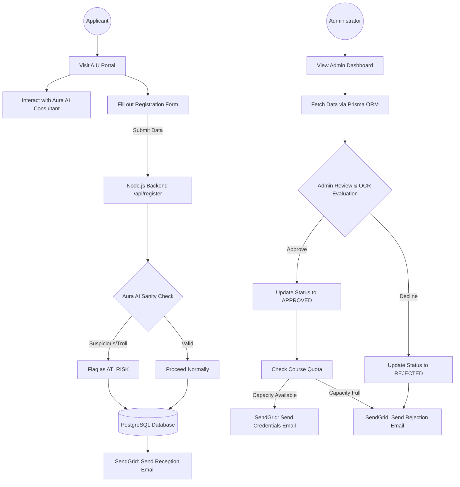
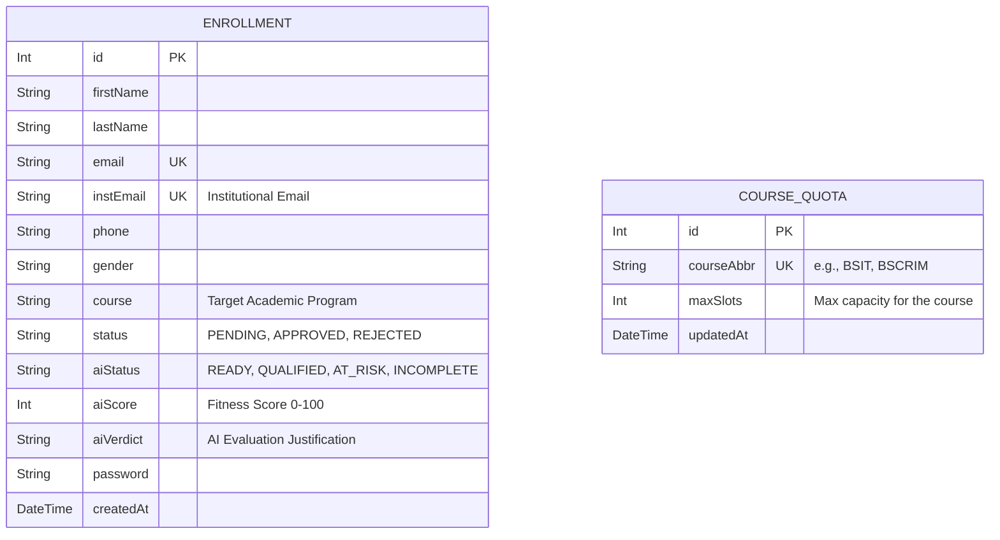

# PROJECT PROPOSAL: Aura Integrated University (AIU) Enrollment System

## 1. Project Title
**Aura Integrated University: An AI-Driven Enrollment and Decision Support System**

## 2. Project Description
This project is a modern, responsive web application designed to streamline the university enrollment process. It features a complete student registration portal and an administrative dashboard. The system integrates Artificial Intelligence (AI) to serve as a digital consultant for students and provides automated credential analysis (OCR) to assist administrators in evaluating academic records.

## 3. Technology Stack (IP1 Requirements)
- **Frontend:** React (powered by Vite, styled with Tailwind CSS)
- **Backend:** Node.js (with Express.js)
- **Database:** PostgreSQL (Cloud-hosted via Supabase)
- **ORM:** Prisma

**Advanced Integrations:**
- **Groq API (LLaMA):** Natural language processing for AI Assistant and Identity Verification.
- **Tesseract.js OCR:** Optical Character Recognition for parsing academic documents.
- **SendGrid API:** Automated email notifications for status updates and credentials dispatch.

## 4. Team Composition and Roles
*(Assign names to your group members here)*
1. **[Name] - Project Manager & Lead Developer:** Architected the system, handled cloud deployments (Netlify/Render), and managed the monorepo structure.
2. **[Name] - Frontend Engineer & UX Designer:** Developed the React components, implemented routing, and ensured mobile responsiveness using Tailwind CSS.
3. **[Name] - Backend Developer:** Handled the Node.js API endpoints, server security, and error-handling logic.
4. **[Name] - Database Administrator:** Designed the PostgreSQL schema, managed migrations via Prisma, and monitored database health.
5. **[Name] - AI Integrations Specialist:** Connected the Groq LLM, configured the Tesseract OCR pipelines, and managed the SendGrid automated email service.

---

## 5. System Architecture Flowchart

*You can copy this Mermaid code into [Mermaid Live Editor](https://mermaid.live/) to generate an image for your Word document.*

---

## 6. Entity-Relationship Diagram (ERD)

*You can copy this Mermaid code into [Mermaid Live Editor](https://mermaid.live/) to generate an ERD image for your Word document.*

---

## 7. Key Features Outline

### A. Student Portal (React)
- **Dynamic Landing Page:** Premium UI with glassmorphism effects and floating AI consultant.
- **Smart Registration Form:** Multi-step wizard collecting personal, academic, and contact details.
- **Real-time Validation:** Client-side prevention of invalid inputs.

### B. Administrator Dashboard (React)
- **Centralized Panel:** Overview of all applicants, pending reviews, and accepted students.
- **Course Quota Management:** Real-time checking of slots per academic program.
- **Aura Document Analysis:** One-click automated reading of uploaded Student Report Cards to suggest approval or rejection.

### C. Automated Services (Node.js)
- **Communication:** Triggers emails for Application Received, Admission Authorized, and Admission Declined.
- **Troll Protection:** Auto-flags names entered with gibberish.
