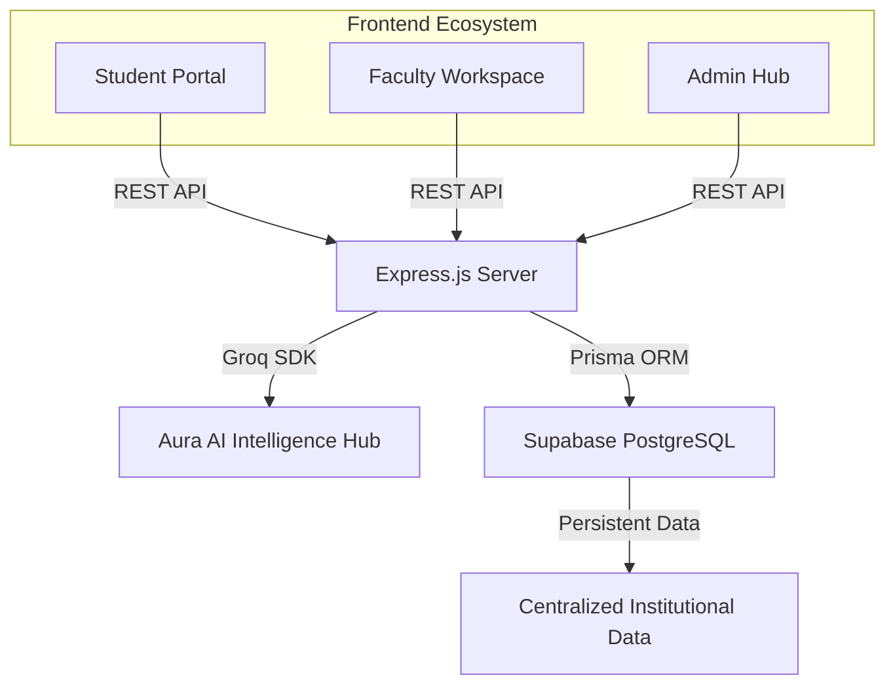
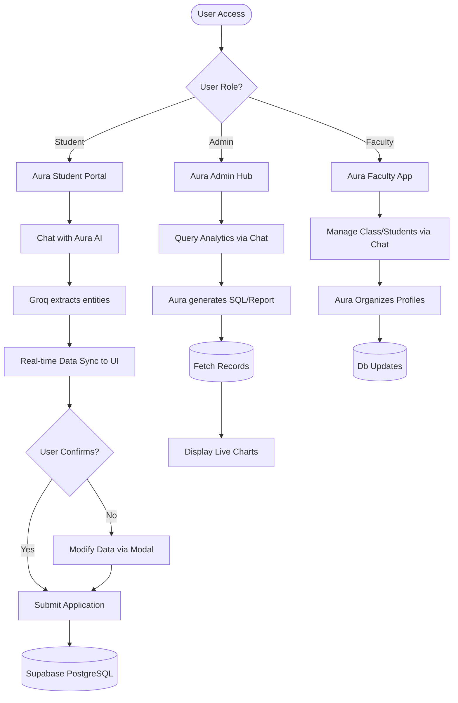
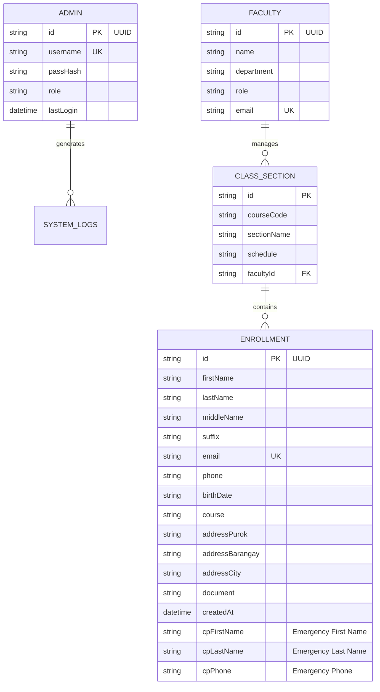

# PROJECT PROPOSAL: AuraEnroll AI 🏛️✨
**System Name:** Aura Integrated University (AIU) Enrollment Portal
**Development Team:** Aura Integrated Software Solutions
**Group Members:**
- Rodney Carlobos
- Jheros Jay Rañola
- Justine Embudo
- John Francis Jone
- Neil Salvan

---

## 1. Executive Summary
AuraEnroll AI is a state-of-the-art academic enrollment portal designed for Aura Integrated University (AIU). The system leverages Autonomous Artificial Intelligence (Aura AI) to streamline the student onboarding process, providing a cinematic, "locked-viewport" user experience that bridges the gap between traditional manual forms and intelligent conversational data intake.

## 2. Project Objectives
- **Autonomous Data Extraction:** Implement Aura AI (via Groq Llama 3) to extract student entities from natural language chat.
- **Robust Data Integrity:** Ensure zero-loss data synchronization between the frontend and a managed PostgreSQL database.
- **Premium UX/UX:** Deliver a high-fidelity, responsive interface with cinematic animations and real-time state feedback.
- **Backend Scalability:** Utilize an Express.js & Prisma architecture for high-performance data operations.

## 3. Technology Stack (The Core) 🛠️
To ensure stability and performance, the system is built on industry-standard technologies:

- **Frontend:** React.js (Vite) + Tailwind CSS + Framer Motion (for cinematic UI).
- **Backend:** Node.js (Express.js) - Providing the high-speed API bridge.
- **Database (ORM):** Prisma 6.x - Optimized for stability and type-safe migrations.
- **Database (Managed):** Supabase (PostgreSQL) - Cloud-hosted data storage with direct SSL connection.
- **AI Engine:** Groq Cloud API (Llama-3-8b) - Delivering sub-second conversational responses and entity extraction.

## 4. Multi-Role AI Ecosystem 🚀
### 🪐 Aura AI: Student Onboarding (Candidate Sync)
A conversational interface where students chat to enroll. Aura AI detects names, courses, and contact details, automatically populating the institutional form in real-time.

### 👑 Aura Admin: Intelligence Hub (Data Analytics)
A dedicated portal for Administrators powered by Groq. Admins can perform **Conversational Analytics** to generate instant institutional reports.
- *Example:* "Aura, provide a demographic breakdown of all BSIT applicants."
- *Function:* Autonomous SQL generation and visualization via Groq Llama-3.

### 🎓 Aura Faculty: Academic Assistant (Class Core)
A specialized workspace for Faculty members to manage student progress and academic workloads.
- *Example:* "Aura, summarize the application trends for the upcoming semester."
- *Function:* AI-assisted student profiling and administrative task automation.

## 5. System Architecture

## 6. User Workflows (Flowchart)

## 7. Entity Relationship Diagram (ERD)

## 8. Implementation Roadmap
1.  **Phase 1: UI Foundation** - Cinematic landing page and Registration Portal setup (Completed).
2.  **Phase 2: Brain Integration** - Groq API & Aura AI conversational logic (Completed).
3.  **Phase 3: Data Persistence** - Prisma/Supabase sync and Schema push (Completed).
4.  **Phase 4: Final Validation** - End-to-end testing and deployment (In Progress).

## 9. Data Dictionary (ERD Table)
| Entity Name | Attribute Name | Data Type | Key | Description |
| :--- | :--- | :--- | :--- | :--- |
| **ENROLLMENT** | id | string / UUID | PK | Unique identifier for the enrollment record. |
| | firstName | string | | Student's first name. |
| | lastName | string | | Student's last name. |
| | email | string | UK | Student's active email address (Unique). |
| | phone | string | | Student's contact number. |
| | course | string | | Selected academic track/course. |
| | addressBarangay | string | | Student's registered barangay. |
| | cpFirstName | string | | Emergency contact's first name. |
| | createdAt | datetime| | Timestamp of the application submission. |
| **ADMIN** | id | string / UUID | PK | Unique identifier for the admin. |
| | username | string | UK | Admin login credential. |
| | role | string | | System permissions (e.g., SuperAdmin). |
| **FACULTY** | id | string / UUID | PK | Unique identifier for the faculty member. |
| | name | string | | Faculty's full name. |
| | department | string | | Assigned department. |
| **CLASS_SECTION** | id | string | PK | Unique identifier for the section. |
| | courseCode | string | | Associated academic course code. |
| | facultyId | string / UUID | FK | Reference to the assigned Faculty. |

## 10. Process Flow Table
| Process Step | Actor/Role | Action Description | System Output / Response |
| :--- | :--- | :--- | :--- |
| **1. System Access** | Any User | Navigates to the AuraEnroll Portal. | System presents role selection (Student, Admin, Faculty). |
| **2. Conversational Intake** | Student | Chats with Aura AI providing personal and course details. | Groq AI extracts entities and auto-fills the registration form on-screen. |
| **3. Final Validation** | Student | Reviews the extracted data. Modifies details via modal if necessary. | Presents a 'Ready for Submission' state. |
| **4. Data Commitment** | Student | Clicks the "Submit Application" button. | Data is securely pushed and stored in the Supabase PostgreSQL database. |
| **5. Query Delivery** | Admin | Asks Aura AI for specific enrollment analytics or trends. | System generates underlying SQL queries mapped to the admin's prompt. |
| **6. Visualization** | Admin | Admin views the newly requested insights. | System renders cinematic live charts based on Supabase records. |
| **7. Class Profiling**| Faculty | Commands Aura to organize student profiles for a specific class. | System automatically groups and updates schedules based on AI extraction. |

---
**Status:** Institutional Server Operational at `http://localhost:5000`
**Database:** Supabase/PostgreSQL 🏛️
