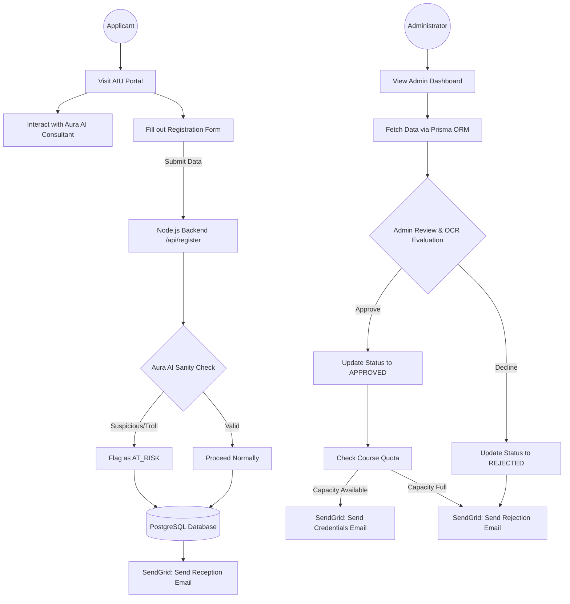
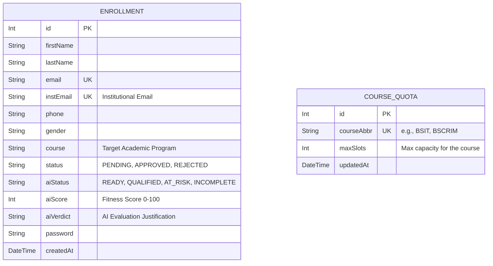

# 🚀 AuraEnroll: AI-Driven Intelligent Student Lifecycle & Enrollment System

> **Aura Integrated University (AIU)**

AuraEnroll is a modern, responsive web application designed to streamline the university enrollment process. It introduces an **"AI-First"** approach to university administration. By integrating a conversational AI assistant (**Aura**), the system removes the friction of manual data entry. Students interact with the AI to provide their details, which are automatically parsed and validated against the school's regulations before final review and submission.

---

> ** Key Features & Innovations

###  Aura: Conversational AI Onboarding
- Replaces traditional forms with an intuitive chat interface.
- Extracts personal information (Name, Age, Academic History) from natural language.
- Intelligently maps structured data to the enrollment form.
- **Troll Protection / Sanity Check:** Automatically flags applications using gibberish or suspicious inputs.

###  Dedicated Portals & Dashboards
- **Student Portal:** Smart registration wizard with a dynamic landing page and client-side validation. (Mockup Design)
- **Admin Portal:** Centralized dashboard to view applicants, manage course quotas, and perform automated AI document reviews.

###  Automated Utilities
- **OCR Document Analysis:** Tesseract.js integration to analyze and parse uploaded academic records (e.g., Student Report Cards) for automated evaluation.
- **Automated Communications:** SendGrid integration handles lifecycle emails (Application Received, Admission Authorized/Declined).

---

> ** Technology Stack

- **Frontend:** React.js (Vite) + Tailwind CSS + Framer Motion
- **Backend:** Node.js (Express framework)
- **Database:** PostgreSQL (Cloud-hosted via Supabase)
- **ORM:** Prisma
- **AI / Integrations:** 
  - Google Gemini API / Groq API (LLaMA) for conversational entity extraction
  - Tesseract.js for Optical Character Recognition (OCR)
  - SendGrid API for transactional emails

---

> **System Architecture Flowchart

---

## 🗄️ Entity-Relationship Diagram (ERD)

*Note: The system enforces quota logic at the application level using the CourseQuota table against approved Enrollments.*

---
